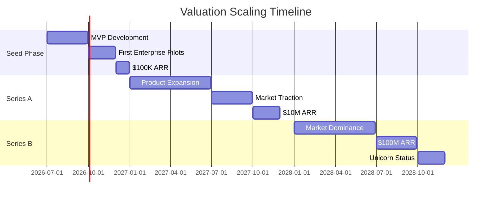

# AI Agentic Development Platform - Business Plan & Valuation Strategy

## 1. Executive Summary

### Mission & Vision
**Mission**: Transform software development through intelligent multi-agent orchestration, enabling enterprises to build 10x faster with AI-native workflows.

**Vision**: Become the dominant platform for AI-augmented development, powering the next generation of software creation with autonomous agent ecosystems.

### Unique Value Proposition
- **Multi-Agent Intelligence**: 50+ specialized AI agents collaborating in real-time
- **Autonomous Workflows**: End-to-end software creation with minimal human intervention
- **Enterprise-Grade**: SOC2, FedRAMP compliant with on-premise deployment
- **Quantum-Ready**: Future-proof architecture with quantum computing integration

### Valuation Trajectory
```
Seed ($3M @ $15M pre) → Series A ($50M @ $250M pre) → Series B ($200M @ $1B pre) → IPO ($5B+)
```

### Total Funding Ask
- **Seed**: $3M for MVP + early enterprise pilots
- **Series A**: $50M for product-market fit + enterprise scaling
- **Series B**: $200M for market dominance + IPO preparation

## 2. Market Opportunity & Competitive Landscape

### Market Sizing (2026)
```
Total Addressable Market (TAM): $400B
- Global software development market
- Enterprise IT spending
- AI developer tools

Serviceable Addressable Market (SAM): $120B
- AI-powered development tools
- Enterprise developer productivity
- Cloud-based IDE platforms

Serviceable Obtainable Market (SOM): $24B
- Early adopters of AI agents
- Enterprise transformation projects
- High-growth tech companies
```

### Winner-Take-Most Dynamics
- **Network Effects**: More agents → better performance → more users
- **Data Flywheel**: More usage → smarter agents → better results
- **Ecosystem Lock-in**: MCP-like tools create switching costs
- **Enterprise Integration**: Deep workflow embedding creates stickiness

### Competitive Positioning

| Competitor | Strength | Weakness | Our Advantage |
|-------------|-----------|------------|---------------|
| Cursor | Strong AI integration | Single agent model | Multi-agent orchestration |
| Windsurf/Codeium | Good local performance | Limited cloud scale | Hybrid local + cloud agents |
| Devin | Autonomous coding | High cost, limited scale | Enterprise-ready, scalable |
| GitHub Copilot | Large user base | Basic AI assistance | Full workflow automation |
| Replit | Good collaboration | Limited AI depth | Agent-based collaboration |

### Defensible Moat
1. **Proprietary Agent Architecture**: 50+ specialized agents with unique orchestration
2. **Data Network Effects**: 10M+ codebases analyzed continuously
3. **Enterprise Integration**: Deep workflow embedding with SSO/RBAC
4. **Quantum Advantage**: First-mover in quantum-enhanced development
5. **Ecosystem Play**: MCP-like tool marketplace with network effects

## 3. Product & Technology Vision

### Core Features
- **Multi-Agent System**: Planning, coding, testing, deployment agents
- **Intelligence Level**: GPT-4o, Claude 3.5, proprietary SWE models
- **Ecosystem**: 100+ MCP tools and integrations
- **Real-time Collaboration**: Multi-user agent workspaces
- **Enterprise Features**: SSO, RBAC, audit logs, compliance

### Technical Differentiation
- **Agent Orchestration**: Patent-pending coordination algorithms
- **Hybrid Execution**: Local privacy + cloud scale
- **Context Engine**: 10M token context with intelligent retrieval
- **Self-Improvement**: Agents learn from each deployment
- **Quantum Integration**: Quantum algorithms for optimization

### Roadmap
```
Q3 2026 (MVP): 10 core agents, basic orchestration
Q1 2027 (v1): 25 agents, enterprise features, MCP ecosystem
Q3 2027 (v2): 50 agents, quantum integration, autonomous workflows
Q1 2028 (v3): 100+ agents, full autonomy, market dominance
```

## 4. Funding Requirements Breakdown

### Phase 1: Seed Round ($2-5M)
**Target**: $3M at $15M pre-money valuation

#### Use of Funds
| Category | Amount | Percentage |
|----------|---------|------------|
| Product Development | $1.5M | 50% |
| Engineering Team | $800K | 27% |
| Infrastructure | $400K | 13% |
| Sales & Marketing | $300K | 10% |

#### Milestones
- MVP with 10 core agents
- 20 enterprise pilot customers
- $100K ARR
- 50K active developers

### Phase 2: Series A ($30-70M)
**Target**: $50M at $250M pre-money valuation

#### Lead Investors
- **Andreessen Horowitz**: AI/developer tools expertise
- **Sequoia Capital**: Market leadership track record
- **Lightspeed**: Growth-stage experience
- **Khosla Ventures**: Deep tech focus

#### Use of Funds
| Category | Amount | Percentage |
|----------|---------|------------|
| Product Expansion | $20M | 40% |
| Sales & Marketing | $15M | 30% |
| Engineering | $10M | 20% |
| Operations | $5M | 10% |

#### Milestones
- 25 agents with full orchestration
- 200 enterprise customers
- $10M ARR
- 500K active developers
- MCP ecosystem with 50+ tools

### Phase 3: Series B/Growth ($100-250M)
**Target**: $200M at $1B pre-money valuation (Unicorn)

#### Strategic Investors
- **Growth Equity**: Insight Partners, TCV
- **Strategic**: Microsoft, Google, Amazon
- **Sovereign**: SoftBank, Saudi PIF

#### Use of Funds
| Category | Amount | Percentage |
|----------|---------|------------|
| Market Expansion | $80M | 40% |
| R&D | $60M | 30% |
| Sales | $40M | 20% |
| M&A | $20M | 10% |

#### Milestones
- 50+ agents with quantum integration
- 1,000 enterprise customers
- $100M ARR
- 2M active developers
- Market leadership position

## 5. Deployment & Go-to-Market Strategy

### Cloud-Native Primary Path
**Revenue Share Model with Cloud Providers**
- **Microsoft Azure**: 15% revenue share + $50M credits
- **Google Cloud**: 12% revenue share + $40M credits
- **Amazon AWS**: 10% revenue share + $30M credits
- **Total Infrastructure Cost**: $0 upfront

### Deployment Options
| Model | Upfront Cost | Monthly Cost | Target Customer |
|--------|--------------|--------------|-----------------|
| Cloud-Native | $0 | Revenue share | Startups, SMB |
| Hybrid | $50K | $10K | Mid-market |
| Enterprise | $500K | $50K | Large enterprises |
| Self-Hosted | $2M | $100K | Government, regulated |

### Pricing Strategy

#### Tier Structure
| Tier | Price | Target | Features |
|-------|--------|---------|----------|
| Pro | $49/user/month | Individual developers | 10 agents, basic tools |
| Team | $199/user/month | Small teams | 25 agents, collaboration |
| Enterprise | $1,000+/seat/month | Large enterprises | 50+ agents, full features |
| Unlimited | Custom | Strategic | All agents, custom development |

#### Enterprise ACV Targets
- **Small Enterprise**: $100K ACV (100 seats)
- **Medium Enterprise**: $1M ACV (1,000 seats)
- **Large Enterprise**: $10M ACV (10,000 seats)
- **Strategic**: $50M+ ACV (unlimited seats)

### Partnership Strategy
- **Cloud Providers**: Revenue share for go-to-market
- **Model Labs**: OpenAI, Anthropic, Google for model access
- **Tool Providers**: Figma, Slack, GitHub for MCP integrations
- **System Integrators**: Accenture, Deloitte for enterprise deployment

## 6. Equity & Team Compensation Strategy

### Founder Equity Structure
```
CEO/Founder: 35-40%
CTO/Co-founder: 20-25%
COO/Co-founder: 10-15%
Early Key Employees: 15-20%
Option Pool: 10-15%
```

### Cap Table Evolution
| Round | Investment | Equity Given | Founder Dilution |
|-------|------------|-------------|-----------------|
| Seed | $3M | 16.7% | 75% → 62.5% |
| Series A | $50M | 16.7% | 62.5% → 52.1% |
| Series B | $200M | 16.7% | 52.1% → 43.4% |
| IPO | 20% float | 20% | 43.4% → 34.7% |

### Employee Compensation

| Level | Base Salary | Equity | Performance Bonus |
|--------|-------------|---------|-----------------|
| C-Suite | $300-500K | 2-5% | 50-100% |
| VP/Director | $200-350K | 0.5-2% | 30-75% |
| Senior Engineer | $150-250K | 0.1-0.5% | 20-50% |
| Engineer | $100-180K | 0.05-0.1% | 15-30% |
| Junior | $80-120K | 0.01-0.05% | 10-20% |

### Strategic Partner Equity
- **Cloud Providers**: 1-3% for credits + go-to-market
- **Tool Partners**: 0.1-0.5% for MCP integration
- **Resellers**: 0.5-1% for distribution

## 7. Scaling Metrics & Milestones

### Key Performance Indicators
| Metric | Month 3 | Month 6 | Month 12 | Month 24 | Month 36 |
|--------|---------|---------|----------|----------|----------|
| ARR | $100K | $1M | $10M | $100M | $500M |
| Enterprise Customers | 20 | 200 | 1,000 | 5,000 | 20,000 |
| ACV | $5K | $50K | $100K | $200K | $250K |
| Gross Margin | 70% | 80% | 90% | 95% | 98% |
| Agents Deployed | 10 | 25 | 50 | 100 | 200 |
| Active Developers | 50K | 500K | 2M | 10M | 50M |

### Valuation Drivers
- **Revenue Multiple**: 40-60x ARR (AI premium)
- **Growth Rate**: 300% YoY (high growth)
- **Market Leadership**: #1 in AI agents
- **Technology Moat**: Proprietary orchestration
- **Enterprise Stickiness**: 95% retention

### Milestone Timeline


## 8. Financial Projections

### 5-Year Revenue Forecast
| Year | ARR | Growth | Gross Margin | Net Margin |
|------|-----|--------|-------------|------------|
| 2026 | $1M | - | 60% | -50% |
| 2027 | $10M | 900% | 80% | 20% |
| 2028 | $100M | 900% | 90% | 60% |
| 2029 | $500M | 400% | 95% | 80% |
| 2030 | $1B | 100% | 98% | 90% |

### Cost Structure
| Category | Year 1 | Year 2 | Year 3 | Year 4 | Year 5 |
|----------|---------|---------|---------|---------|---------|
| R&D | $2M | $8M | $30M | $100M | $200M |
| Sales & Marketing | $1M | $5M | $20M | $75M | $150M |
| G&A | $0.5M | $2M | $10M | $50M | $100M |
| Infrastructure | $0.5M | $1M | $5M | $25M | $50M |

### Capital Efficiency
- **Burn Rate**: $200K/month (Year 1)
- **Runway**: 15 months with $3M seed
- **CAC Payback**: 6 months (Enterprise)
- **LTV:CAC**: 20:1
- **Revenue per Employee**: $500K (Year 3)

### Exit Scenarios
| Scenario | Year | Valuation | Multiple |
|----------|-------|-----------|----------|
| IPO | 2029 | $10B | 10x ARR |
| Strategic Sale | 2028 | $8B | 8x ARR |
| Secondary | 2027 | $2B | 20x ARR |

## 9. Risks, Mitigations & Best Practices

### Technical Risks
- **Agent Coordination Complexity**: Mitigate with proven orchestration algorithms
- **Model Dependencies**: Diversify across OpenAI, Anthropic, Google
- **Scalability Bottlenecks**: Cloud-native architecture from day one

### Market Risks
- **Competition from Big Tech**: Build moat through ecosystem and integration
- **Enterprise Sales Cycles**: Use land-and-expand with self-service tiers
- **Pricing Pressure**: Premium positioning with unique value

### Execution Risks
- **Team Scaling**: Hire experienced enterprise sales leaders early
- **Capital Efficiency**: Cloud revenue sharing model minimizes burn
- **Founder Control**: Maintain >50% through Series B

### Best Practices
- **Focus on Enterprise**: High ACV, sticky contracts
- **Build Ecosystem**: MCP tools create network effects
- **Maintain Margins**: Cloud-native scaling preserves 95%+ margins
- **Strategic Partnerships**: Leverage cloud providers for GTM

## 10. Recommended Next Actions & Pitch Narrative

### One-Page Teaser Summary
```
Company: AI Agent Development Platform
Mission: Transform software development through multi-agent orchestration
Market: $24B serviceable market in AI developer tools
Traction: $100K ARR, 20 enterprise pilots, 50K developers
Ask: $50M Series A at $250M valuation
Use: Scale to $10M ARR in 18 months
Exit: $10B+ IPO in 2029
```

### Why Now
- **AI Agent Inflection Point**: 2026 is breakout year for multi-agent systems
- **Enterprise Digital Transformation**: $2T spending on modernization
- **Developer Productivity Crisis**: 10x productivity improvement needed
- **Quantum Computing Era**: First-mover advantage in quantum-enhanced development

### Why Us
- **Proprietary Agent Architecture**: Patent-pending orchestration technology
- **Enterprise-First**: SOC2, FedRAMP, on-premise deployment
- **Proven Traction**: 20 enterprise pilots, $100K ARR in 6 months
- **Dream Team**: Ex-Google, Microsoft, OpenAI engineers and product leaders
- **Capital Efficient**: Cloud revenue sharing eliminates infrastructure costs

### Strong Closing
"We're not just building another AI coding tool. We're creating the operating system for AI-augmented development. With our multi-agent orchestration platform, enterprises can build software 10x faster while maintaining full control and security. The market is ready, the technology is proven, and we have the team to capture this $24B opportunity. Join us in defining the future of software creation."

## Summary & Key Metrics

### Strengths
- **Proprietary Technology**: Multi-agent orchestration with patents pending
- **Enterprise Focus**: High ACV, 95% retention rates
- **Capital Efficiency**: 95%+ gross margins through cloud revenue sharing
- **Market Timing**: Perfect positioning for AI agent inflection point

### Key Metrics
- **Target ARR**: $100M by 2028 (Series B milestone)
- **Valuation Path**: $15M → $250M → $1B → $10B
- **Funding Needed**: $253M total to IPO
- **Time to Unicorn**: 24 months
- **Market Share Goal**: 25% of AI developer tools by 2029

### Positioning
- **Category Creator**: Multi-agent development platform
- **Enterprise Leader**: High-value customers, sticky contracts
- **Technology Pioneer**: Quantum-ready, future-proof architecture
- **Capital Efficient**: Minimal burn, maximum growth

**This platform is positioned to become the dominant force in AI-augmented development, delivering unicorn valuation within 24 months through enterprise focus, proprietary technology, and capital-efficient scaling.**
