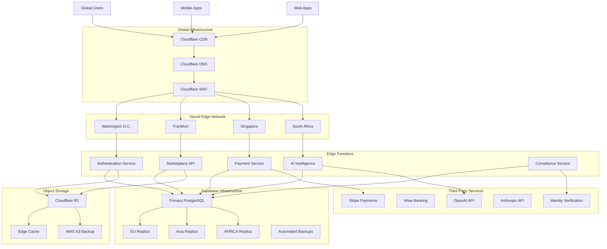

# 🏗️ Worldmine Enterprise Architecture

## 🌍 System Architecture Diagram



## 🏢 Folder Structure

```
worldmine/
├── 📁 infrastructure/                    # Infrastructure as Code
│   ├── terraform/                     # Terraform configurations
│   ├── kubernetes/                    # K8s manifests
│   ├── docker/                        # Docker configurations
│   └── monitoring/                    # Monitoring stack
├── 📁 apps/                           # Microservices
│   ├── web/                          # Frontend application
│   ├── api-gateway/                   # API Gateway
│   ├── auth-service/                  # Authentication service
│   ├── marketplace-service/             # Marketplace service
│   ├── payment-service/                # Payment service
│   ├── ai-service/                    # AI intelligence service
│   └── compliance-service/             # Compliance service
├── 📁 shared/                          # Shared libraries
│   ├── database/                      # Database models
│   ├── messaging/                     # Event bus
│   ├── security/                      # Security utilities
│   └── monitoring/                    # Monitoring utilities
├── 📁 tools/                           # Development tools
│   ├── scripts/                       # Utility scripts
│   ├── testing/                       # Test utilities
│   └── deployment/                    # Deployment scripts
├── 📁 docs/                            # Documentation
│   ├── api/                           # API documentation
│   ├── architecture/                   # Architecture docs
│   ├── security/                      # Security policies
│   └── deployment/                    # Deployment guides
└── 📁 tests/                           # Test suites
    ├── unit/                          # Unit tests
    ├── integration/                   # Integration tests
    ├── e2e/                           # End-to-end tests
    └── performance/                   # Performance tests
```

## 🌐 Global Infrastructure Configuration

### CDN Architecture
```yaml
# cloudflare-config.yaml
cdn:
  provider: cloudflare
  regions:
    - north_america: iad1
    - europe: fra1
    - asia: sin1
    - africa: jnb1
  
  caching:
    static_assets: 30d
    api_responses: 1h
    dynamic_content: 5m
    
  security:
    waf: enabled
    ddos_protection: enabled
    bot_management: enabled
```

### Multi-Region Database
```yaml
# database-config.yaml
database:
  provider: supabase
  primary:
    region: us-east-1
    instance: db.large
    storage: 1tb
    
  replicas:
    - region: eu-west-1
      instance: db.medium
      lag: <100ms
    - region: ap-southeast-1
      instance: db.medium
      lag: <200ms
    - region: af-south-1
      instance: db.medium
      lag: <300ms
      
  backup:
    retention: 30d
    point_in_time_recovery: true
    cross_region_replication: true
```

### Object Storage Strategy
```yaml
# storage-config.yaml
storage:
  primary:
    provider: cloudflare_r2
    regions:
      - primary: us-east-1
      - replication: eu-west-1, ap-southeast-1, af-south-1
      
  backup:
    provider: aws_s3
    region: us-west-2
    retention: 90d
    
  cdn_integration:
    edge_caching: true
    smart_cache_headers: true
    compression: auto
```

## 🏪 Marketplace Core Features

### Seller Capabilities
```typescript
// seller-service/types.ts
export interface SellerProfile {
  id: string;
  businessName: string;
  verificationStatus: 'pending' | 'verified' | 'rejected';
  miningLicense: MiningLicense;
  geologicalReports: GeologicalReport[];
  listings: MineralListing[];
  rating: SellerRating;
  capabilities: SellerCapabilities;
}

export interface MineralListing {
  id: string;
  sellerId: string;
  mineralType: MineralType;
  quantity: number;
  unit: string;
  price: number;
  currency: string;
  location: GeographicLocation;
  quality: QualityAssessment;
  certifications: Certification[];
  photos: MediaFile[];
  documents: Document[];
  auctionSettings?: AuctionSettings;
  negotiationEnabled: boolean;
  shippingOptions: ShippingOption[];
  createdAt: Date;
  updatedAt: Date;
}

export interface AuctionSettings {
  enabled: boolean;
  startDate: Date;
  endDate: Date;
  startingBid: number;
  reservePrice: number;
  bidIncrement: number;
  currentBid?: number;
  currentBidder?: string;
  bids: Bid[];
}
```

### Buyer Capabilities
```typescript
// buyer-service/types.ts
export interface BuyerProfile {
  id: string;
  company: CompanyInfo;
  verificationStatus: 'pending' | 'verified' | 'rejected';
  paymentMethods: PaymentMethod[];
  shippingAddresses: Address[];
  purchaseHistory: PurchaseHistory[];
  preferences: BuyerPreferences;
  escrowBalance: number;
}

export interface SearchFilters {
  mineralType: MineralType[];
  priceRange: PriceRange;
  location: GeographicLocation;
  quality: QualityLevel[];
  certification: CertificationType[];
  sellerRating: RatingRange;
  availability: AvailabilityStatus;
  shippingOptions: ShippingMethod[];
}

export interface EscrowTransaction {
  id: string;
  buyerId: string;
  sellerId: string;
  listingId: string;
  amount: number;
  currency: string;
  status: 'pending' | 'funded' | 'shipped' | 'delivered' | 'completed' | 'disputed';
  milestones: Milestone[];
  documents: TransactionDocument[];
  tracking: ShippingTracking;
  createdAt: Date;
  updatedAt: Date;
}
```

## 💳 Payment Infrastructure

### Escrow Payment Flow
```typescript
// payment-service/escrow.ts
export class EscrowService {
  async createEscrow(
    buyerId: string,
    sellerId: string,
    listingId: string,
    amount: number,
    currency: string,
    milestones: Milestone[]
  ): Promise<EscrowTransaction> {
    // 1. Create escrow transaction
    // 2. Lock funds from buyer
    // 3. Notify seller of funds secured
    // 4. Generate ISO 20022 payment message
  }

  async releaseMilestone(
    escrowId: string,
    milestoneId: string,
    confirmation: MilestoneConfirmation
  ): Promise<MilestoneRelease> {
    // 1. Verify milestone completion
    // 2. Release partial funds to seller
    // 3. Update transaction status
    // 4. Send notifications
  }

  async handleDispute(
    escrowId: string,
    dispute: DisputeClaim
  ): Promise<DisputeResolution> {
    // 1. Freeze remaining funds
    // 2. Notify compliance service
    // 3. Create dispute case
    // 4. Schedule review
  }
}
```

### Multi-Currency Support
```typescript
// payment-service/currency.ts
export interface CurrencyService {
  getExchangeRates(): Promise<ExchangeRates>;
  convertAmount(
    amount: number,
    fromCurrency: string,
    toCurrency: string
  ): Promise<CurrencyConversion>;
  getSupportedCurrencies(): Promise<Currency[]>;
}

// Integration with payment providers
export interface PaymentProvider {
  name: 'stripe' | 'paypal' | 'wise' | 'flutterwave';
  processPayment(payment: PaymentRequest): Promise<PaymentResult>;
  processRefund(refund: RefundRequest): Promise<RefundResult>;
  getPaymentStatus(paymentId: string): Promise<PaymentStatus>;
}
```

## 🤝 User Trust & Verification

### KYC Identity Verification
```typescript
// verification-service/kyc.ts
export interface KYCService {
  async initiateKYC(userId: string, kycData: KYCData): Promise<KYCSession>;
  async uploadDocument(
    sessionId: string,
    document: VerificationDocument
  ): Promise<DocumentUploadResult>;
  async checkVerificationStatus(sessionId: string): Promise<KYCStatus>;
  async getVerificationLevel(userId: string): Promise<VerificationLevel>;
}

export interface VerificationProvider {
  name: 'stripe_identity' | 'sumsub' | 'onfido';
  verifyIdentity(data: IdentityData): Promise<VerificationResult>;
  verifyDocument(document: Document): Promise<DocumentVerification>;
}
```

### Mining License Validation
```typescript
// verification-service/mining-license.ts
export interface MiningLicenseService {
  async validateLicense(
    licenseNumber: string,
    issuingCountry: string,
    licenseType: LicenseType
  ): Promise<LicenseValidation>;
  async verifyAuthenticity(license: MiningLicense): Promise<AuthenticityResult>;
  async checkExpiry(licenseId: string): Promise<ExpiryStatus>;
}
```

## 🧠 AI Intelligence Layer

### Mineral Price Prediction
```typescript
// ai-service/price-prediction.ts
export interface PricePredictionService {
  predictMineralPrice(
    mineralType: MineralType,
    quality: QualityLevel,
    timeframe: Timeframe,
    location: GeographicLocation
  ): Promise<PricePrediction>;
  
  getMarketTrends(
    mineralType: MineralType,
    period: TimePeriod
  ): Promise<MarketTrend[]>;
  
  analyzeSupplyDemand(
    mineralType: MineralType,
    region: GeographicRegion
  ): Promise<SupplyDemandAnalysis>;
}
```

### Fraud Detection
```typescript
// ai-service/fraud-detection.ts
export interface FraudDetectionService {
  analyzeTransaction(transaction: TransactionData): Promise<FraudRiskScore>;
  analyzeUserBehavior(userId: string, actions: UserAction[]): Promise<BehavioralRisk>;
  detectSuspiciousPatterns(patterns: ActivityPattern[]): Promise<SuspiciousActivity[]>;
  generateRiskReport(userId: string): Promise<RiskAssessment>;
}
```

## 🔒 Security Architecture

### Authentication & Authorization
```typescript
// security-service/auth.ts
export interface AuthenticationService {
  // OAuth providers
  authenticateWithGoogle(token: string): Promise<AuthResult>;
  authenticateWithMicrosoft(token: string): Promise<AuthResult>;
  authenticateWithLinkedIn(token: string): Promise<AuthResult>;
  
  // Multi-factor authentication
  enableTOTP(userId: string): Promise<TOTPSetup>;
  verifyTOTP(userId: string, token: string): Promise<TOTPResult>;
  enableBiometric(userId: string, biometricData: BiometricData): Promise<BiometricResult>;
  
  // Session management
  createSession(user: User, device: DeviceInfo): Promise<Session>;
  validateSession(sessionId: string): Promise<SessionValidation>;
  revokeSession(sessionId: string): Promise<void>;
}
```

### API Protection
```typescript
// security-service/api-protection.ts
export interface APIProtectionService {
  // Rate limiting
  checkRateLimit(clientId: string, endpoint: string): Promise<RateLimitResult>;
  applyRateLimit(clientId: string, limit: RateLimit): Promise<void>;
  
  // API key management
  generateApiKey(userId: string, permissions: Permission[]): Promise<ApiKey>;
  validateApiKey(apiKey: string): Promise<ApiKeyValidation>;
  revokeApiKey(apiKeyId: string): Promise<void>;
  
  // Token validation
  validateJWT(token: string): Promise<TokenValidation>;
  validateOAuthToken(token: string, provider: OAuthProvider): Promise<TokenValidation>;
}
```

## 📋 Legal Compliance

### Privacy Regulations
```typescript
// compliance-service/privacy.ts
export interface PrivacyComplianceService {
  // GDPR compliance
  handleDataSubjectRequest(request: DataSubjectRequest): Promise<ComplianceResult>;
  anonymizeUserData(userId: string): Promise<AnonymizationResult>;
  exportUserData(userId: string, format: ExportFormat): Promise<DataExport>;
  deleteUserData(userId: string, retention: RetentionPolicy): Promise<DeletionResult>;
  
  // Consent management
  updateConsent(userId: string, consentData: ConsentUpdate): Promise<ConsentResult>;
  getConsentHistory(userId: string): Promise<ConsentHistory>;
}
```

## 🔧 DevOps & CI/CD Pipeline

### GitHub Actions Workflow
```yaml
# .github/workflows/ci-cd.yml
name: CI/CD Pipeline

on:
  push:
    branches: [main, develop]
  pull_request:
    branches: [main]

jobs:
  test:
    runs-on: ubuntu-latest
    steps:
      - uses: actions/checkout@v3
      - name: Setup Node.js
        uses: actions/setup-node@v3
        with:
          node-version: '18'
          cache: 'npm'
      
      - name: Install dependencies
        run: npm ci
      
      - name: Run linting
        run: npm run lint
      
      - name: Run unit tests
        run: npm run test:unit
      
      - name: Run integration tests
        run: npm run test:integration
      
      - name: Security scan
        run: npm run security:scan
      
      - name: Accessibility tests
        run: npm run test:a11y

  build:
    needs: test
    runs-on: ubuntu-latest
    steps:
      - uses: actions/checkout@v3
      - name: Build application
        run: npm run build
      - name: Build Docker image
        run: docker build -t worldmine:${{ github.sha }} .
      - name: Push to registry
        run: |
          echo ${{ secrets.DOCKER_PASSWORD }} | docker login -u ${{ secrets.DOCKER_USERNAME }} --password-stdin
          docker push worldmine:${{ github.sha }}

  deploy:
    needs: build
    runs-on: ubuntu-latest
    if: github.ref == 'refs/heads/main'
    steps:
      - name: Deploy to production
        run: |
          # Deploy to Vercel
          npx vercel --prod --token=${{ secrets.VERCEL_TOKEN }}
          
          # Deploy to Kubernetes
          kubectl apply -f k8s/
```

## 📊 Monitoring & Observability

### Monitoring Stack Configuration
```yaml
# monitoring/docker-compose.yml
version: '3.8'
services:
  prometheus:
    image: prom/prometheus
    ports:
      - "9090:9090"
    volumes:
      - ./prometheus.yml:/etc/prometheus.yml
      
  grafana:
    image: grafana/grafana
    ports:
      - "3001:3000"
    environment:
      - GF_SECURITY_ADMIN_PASSWORD=${GRAFANA_PASSWORD}
    volumes:
      - grafana-storage:/var/lib/grafana
      
  sentry:
    image: sentry
    environment:
      - SENTRY_DSN=${SENTRY_DSN}
      - SENTRY_AUTH_TOKEN=${SENTRY_AUTH_TOKEN}
      
  jaeger:
    image: jaegertracing/all-in-one
    ports:
      - "16686:16686"
      - "14268:14268"
```

## 📈 Scalability Architecture

### Horizontal Scaling Strategy
```typescript
// scalability/auto-scaling.ts
export interface AutoScalingConfig {
  minInstances: number;
  maxInstances: number;
  targetCPU: number;
  targetMemory: number;
  scaleUpCooldown: number;
  scaleDownCooldown: number;
}

export interface LoadBalancer {
  distributeTraffic(instances: ServiceInstance[]): Promise<TrafficDistribution>;
  healthCheck(instance: ServiceInstance): Promise<HealthStatus>;
  routeTraffic(request: IncomingRequest): Promise<ServiceInstance>;
}
```

## 🌍 Internationalization

### Multi-Language Support
```typescript
// i18n/translation-manager.ts
export interface TranslationManager {
  getSupportedLanguages(): Promise<Language[]>;
  loadTranslations(language: Language): Promise<Translations>;
  detectUserLanguage(): Promise<Language>;
  setLanguage(language: Language): Promise<void>;
  formatCurrency(amount: number, currency: string, locale: string): string;
  formatDate(date: Date, locale: string): string;
}

// Supported languages
export const SUPPORTED_LANGUAGES = {
  en: { name: 'English', code: 'en', rtl: false },
  es: { name: 'Spanish', code: 'es', rtl: false },
  am: { name: 'Amharic', code: 'am', rtl: true },
  ar: { name: 'Arabic', code: 'ar', rtl: true },
  fr: { name: 'French', code: 'fr', rtl: false },
  zh: { name: 'Chinese', code: 'zh', rtl: false }
} as const;
```

## 🧪 Testing Strategy

### Comprehensive Test Suite
```typescript
// testing/test-config.ts
export interface TestConfig {
  unit: {
    frameworks: ['jest', 'vitest'];
    coverage: { threshold: 80 };
    types: ['unit', 'integration'];
  };
  
  e2e: {
    frameworks: ['playwright', 'cypress'];
    browsers: ['chromium', 'firefox', 'webkit'];
    devices: ['desktop', 'mobile', 'tablet'];
  };
  
  performance: {
    tools: ['k6', 'artillery'];
    scenarios: ['normal_load', 'peak_load', 'stress_test'];
    metrics: ['response_time', 'throughput', 'error_rate'];
  };
  
  security: {
    tools: ['owasp_zap', 'burp_suite'];
    scans: ['sast', 'dast', 'dependency_check'];
  };
  
  accessibility: {
    tools: ['axe', 'lighthouse'];
    standards: ['wcag_2_2_aa', 'section_508'];
  };
}
```

This architecture provides enterprise-grade scalability, security, and global deployment capabilities for the Worldmine mineral marketplace platform.
